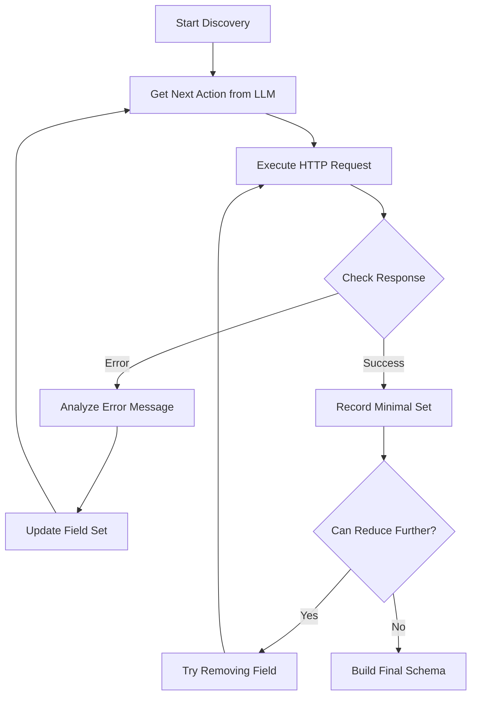

# API Discovery Agent Design Document

## Overview
The API Discovery Agent is an intelligent system that automatically discovers the minimum set of fields needed for successful API interactions through systematic testing and analysis. It uses the DeepSeek LLM (Large Language Model) for reasoning about API responses and making intelligent decisions about field testing.

## Core Components

### 1. Discovery Agent (`DeepseekAgent`)
The main orchestrator that manages the discovery process:
```go
type DeepseekAgent struct {
    request            models.DiscoverRequest   // Input request details
    conversation       []models.Message         // LLM conversation history
    knownFields        map[string]*FieldInfo    // Discovered field information
    fieldStatus        map[string]*FieldTestStatus  // Testing status for each field
    currentBody        map[string]interface{}   // Current request body
    iterations         int                      // Current iteration count
    llmClient          *llm.DeepseekClient     // LLM client for reasoning
    fieldRelationships []FieldRelationship     // Field dependencies
    minimalSuccessBody map[string]interface{}  // Minimal body that succeeded
}
```

### 2. Field Information (`FieldInfo`)
Stores discovered information about each field:
```go
type FieldInfo struct {
    Name        string          // Field name
    Type        string          // Data type (string, integer, etc.)
    Format      string          // Special format (email, date, etc.)
    Pattern     string          // Regex pattern if applicable
    MinLength   *int            // Minimum length for strings
    MaxLength   *int            // Maximum length for strings
    Minimum     *float64        // Minimum value for numbers
    Maximum     *float64        // Maximum value for numbers
    Enum        []string        // Possible values for enums
    Children    []FieldInfo     // Nested fields for objects
    SampleValue interface{}     // Example valid value
    Description string          // Field description
}
```

### 3. Field Testing Status (`FieldTestStatus`)
Tracks the testing progress for each field:
```go
type FieldTestStatus struct {
    IsDiscovered        bool            // Field has been found
    IsTypeVerified      bool            // Type has been verified
    IsInMinimalSet      bool            // Part of minimal successful set
    TestedValues        []interface{}   // Values tried
    FailedValues        []interface{}   // Values that failed
    ValidationErrors    []string        // Error messages received
    SuccessfulTests     int            // Successful test count
    FailedTests         int            // Failed test count
}
```

## Discovery Process

### 1. Initialization
- Create new agent with discovery request
- Initialize empty field maps and status tracking
- Set up LLM conversation with system prompt

### 2. Discovery Loop


### 3. Field Discovery Methods

#### a. Error Analysis
- Parse structured error responses
- Extract field names
- Identify validation rules
- Build up minimal field set

#### b. Success Analysis
- Record successful request body as potential minimal set
- Try removing fields to find true minimal set
- Verify field types
- Identify server-generated fields

#### c. Type Detection
- Infer types from error messages
- Recognize special formats (email, date, etc.)
- Handle nested objects and arrays
- Track validation patterns

### 4. Field Relationships
Tracks dependencies between fields in the minimal set:
```go
type FieldRelationship struct {
    DependentField string    // Field that depends on another
    ParentField    string    // Field being depended on
    RelationType   string    // Type of relationship
}
```

Types of relationships:
- `part_of_minimal_set`: Fields that must be present together
- `conflicts`: Fields that cannot be used together
- `conditional`: Field needed based on another's value

## LLM Integration

### 1. Message Structure
```go
type Message struct {
    Role    string    // system, user, assistant
    Content string    // message content
}
```

### 2. LLM Usage
- Uses DeepSeek R1 model for better reasoning
- Maintains conversation context
- Follows strict message ordering requirements:
  1. System messages first
  2. First non-system message must be user
  3. Strict user/assistant alternation
  4. Last message must be user

## Completion Criteria
Discovery is considered complete when:
1. Found a successful request body
2. Verified it's the minimal set needed
3. Cannot remove any more fields
4. Understood field relationships

## Error Handling
- Structured error parsing
- Regex pattern matching for common errors
- Validation error analysis
- Rate limiting and retry logic
- Timeout handling

## Future Improvements
1. Enhanced validation rule detection
2. Smarter test value generation
3. Better batch request handling
4. Response analysis improvements
5. Schema version detection
6. Caching and rate limit awareness
7. Documentation generation 